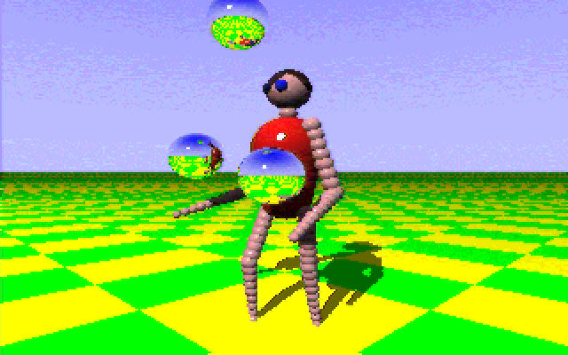

# Eric-Graham-1987-Juggler-Raytracer-1.0

## Overview

Eric Graham's original 1987 Juggler Raytracer 1.0 source code and related data

This is the same data archived on archive.org at https://archive.org/details/raytracer-1987-graham-source-code.adf.-7z

I have extracted the ADF into portable files using my Pthon port ( https://github.com/AlphaPixel/Extract-ADF-Python ) of Extract ADF ( https://github.com/mist64/extract-adf ). I had OpenAI Codex create the Python port specifically for this task.

Ernie Wright also has copies of some of the files but his web site:
http://www.etwright.org/cghist/juggler.html
http://www.etwright.org/cghist/juggler_rt.html
links to this copy of the ADF: https://www.dottyflowers.com/index.php?file=home&module=blog&page=viewpost&post=raytracer-1_0-%28plus-source%29

which is no longer live.

Since it's hard to actually find the textual C source online, I resolved to archive it here on GitHub for future programmers to learn and appreciate thier history.

I contacted Eric Graham on Feb 10, 2026 to request permission to redistribute the code.

> *I was hoping to put the code onto GitHub for posterity, and I realized there is no explicit license, or copyright release on the code. I'm wondering if you'd be willing to specifically declare a license or a release of copyright so it would be legitimate on GitHub.*

Eric replied the same day with
> *Yes, I'd be happy to! It is ironic to be most known for something that I did in a day! As far as I am concerned anyone can do what they want with the code, so long as I get a mention!*

So, by Eric's directive, it is now declared under Public Domain, with an Attribution clause, which shouldn't be hard to abide by. I can't imagine anyone WOULDN'T want to acknowledge the contribution of Eric and his  Juggler and raytracing work which literally altered the careers and lives of many of us who saw it and saw the whole computing universe change in an instant. I have had a career in computer graphics because Juggler sold me on buying an Amiga.

For throughness, I will also catalog several other Juggler resources here:

Juggler original animation output converted to animated GIF:
https://archive.org/details/amiga-juggler

Ernie Wright web site:
http://www.etwright.org/cghist/juggler.html
http://www.etwright.org/cghist/juggler_rt.html

Werner & Walter Randelshofer Juggler web pages:
https://www.randelshofer.ch/animations/anims/eric_graham/Juggler.anim.html

Juggler in Java by Meatfighter.com
https://meatfighter.com/juggler/

Ben Hanke ( http://13h.org/ ) Real time WebGL Juggler
http://13h.org/juggler/

Juggler Encore demo party entry (Windows)
https://www.reddit.com/r/raytracing/comments/13o7smc/my_realtime_holographic_recreation_of_the_1986/

Juggler raytracer in ShaderToy by https://www.shadertoy.com/user/pellicus (Dario Pelalla):
https://www.shadertoy.com/view/llXSWr

Juggler in Rust:
https://github.com/unfastener/juggler-in-rust

## Manifest of Files included

Raytracer_1987_Graham_Source_Code.adf.7z : Original distribution of ADF file (7z compressed) from archive.org

media/ : collected media of the Juggler output. Contents follow:
- `Juggler.png` (24,296 bytes): One of the HAM frames from Juggler, converted to 24-bit, upscaled to 640x400 and saved as PNG.
- `juggler.avi` (328,538 bytes): Ernie Wright's custom extraction and conversion of the whole Juggler animation to Windows AVI format. 320x200. Difficult for many modern media playback tools to decode.
- `Juggler.mp4` (648,513 bytes): Ernie Wright's AVI format upscaled to 1462x1080 and transcoded to MP4.

Raytracer_1987_Graham_Source_Code/ : folder containing all files found in the root of the extracted ADF. Contents follow:
- `.info` (87 bytes): Workbench disk metadata
- `dos.bmap` (426 bytes): Amiga DOS library call map/stub table with entries such as `Open`, `Close`, `Read`, `Write`, `Seek`, `DeleteFile`, and `Rename`.
- `dos.bmap.info` (338 bytes): Workbench icon metadata for `dos.bmap`.
- `dragon` (48,052 bytes): 320x200 HAM-style rendered still image data for the dragon scene, with dimensions and palette data at the file start.
- `dragon.dat` (2,107 bytes): Plain-text scene description for the dragon render, including camera position, viewport angles, sphere colors/types, and lamp settings.
- `ele` (48,052 bytes): 320x200 HAM-style rendered still image data for the elephant scene, with dimensions and palette data at the file start.
- `ele.dat` (1,000 bytes): Plain-text scene description for the elephant render, defining grouped spheres, colors, camera/view settings, and lighting.
- `graphics.bmap` (1,397 bytes): Amiga graphics library call map/stub table with entries such as `BltBitMap`, `ClearScreen`, `Text`, `SetFont`, and related graphics functions.
- `graphics.bmap.info` (338 bytes): Workbench icon metadata for `graphics.bmap`.
- `intuition.bmap` (1,145 bytes): Amiga Intuition library call map/stub table with entries such as `OpenIntuition`, `AddGadget`, `CloseScreen`, and `CloseWindow`.
- `intuition.bmap.info` (338 bytes): Workbench icon metadata for `intuition.bmap`.
- `movie` (14,220 bytes): Amiga executable movie player, version 1.5 dated 1986, which loads `movie.data`, displays raytraced HAM frames, and accepts digit speed keys plus ESC to exit.
- `movie.data` (295,610 bytes): Compressed frame data used by the `movie` player; begins with frame/count and 320x200 HAM palette/frame payload information.
- `movie.info` (938 bytes): Workbench icon metadata for the `movie` executable.
- `movie2` (14,368 bytes): Amiga executable movie player, version 2.0 dated 1987, which loads `movie2.data` and includes explanatory text about the raytraced images and 4096-color HAM display.
- `movie2.data` (270,342 bytes): Compressed frame data used by the `movie2` player; begins with frame/count and 320x200 HAM palette/frame payload information.
- `movie2.info` (938 bytes): Workbench icon metadata for the `movie2` executable.
- `raytrace.a` (13,119 bytes): Amiga BASIC raytracer program implementing the simple sphere/ground/sky scene, HAM screen setup, ray intersection, shading, reflection, and display loop.
- `raytrace.a.info` (354 bytes): Workbench icon metadata for `raytrace.a`.
- `raytrace.BAK` (12,502 bytes): Backup copy of the BASIC raytracer source, similar to `raytrace.a` but without the opening REM copyright block.
- `robot.dat` (810 bytes): Plain-text scene description for a robot/humanoid render, defining camera/view settings, multiple colored spheres, and a lamp.
- `rt1.c` (11,049 bytes): C source for the core raytracer: ray generation, sphere/ground/lamp intersection, sky gradient, diffuse lighting, highlights, mirror reflection, and vector math.
- `rt2.c` (5,201 bytes): C source for scene setup and brightness-to-HAM output: observer configuration, one-sphere test scene, lamp exposure scaling, and `ham()` pixel conversion.
- `rt3.c` (5,688 bytes): C source for Amiga-specific display support: opens graphics/intuition/dos libraries, creates a 320x200 HAM custom screen/window, manages palette allocation, writes pixels, and cleans up.
- `ss` (22,432 bytes): Amiga Hunk executable identified internally as `SS: Ray Tracing Display Program`, a slideshow/display tool for rendered illustrations with return-to-advance and ESC-to-exit prompts.
- `ssg` (49,992 bytes): Amiga Hunk executable identified internally as `SSG: Scene Simulation Generator`, scene/raytrace generator that reads scene input, reports sphere counts, and writes output/dump/register files.
- `Trashcan.info` (430 bytes): Workbench icon metadata for the `Trashcan` drawer.

## Future

I will catalog additional work I've done with this code in this repository in the future. I have a WebGPU version of it that's kind of interesting.
