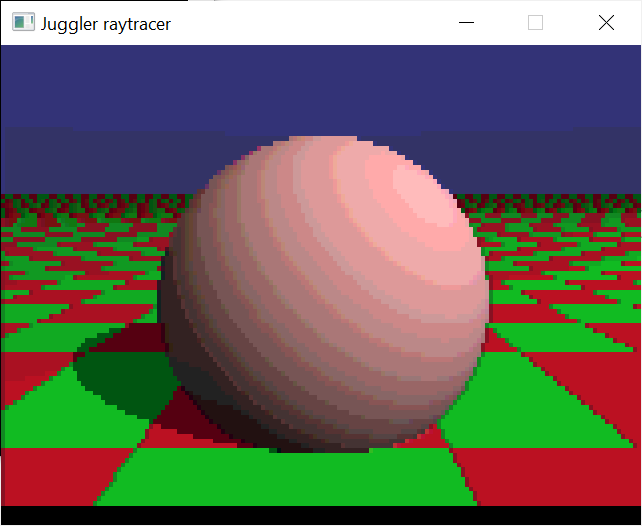

# Eric-Graham-1987-Juggler-Raytracer-1.0

## Overview

Eric Graham's original 1987 Juggler Raytracer 1.0 source code and related data

This is the same data archived on archive.org at https://archive.org/details/raytracer-1987-graham-source-code.adf.-7z

I have extracted the ADF into portable files using my Python port ( https://github.com/AlphaPixel/Extract-ADF-Python ) of Extract ADF ( https://github.com/mist64/extract-adf ). I had OpenAI Codex create the Python port specifically for this task.

Ernie Wright also has copies of some of the files but his web site:
http://www.etwright.org/cghist/juggler.html
http://www.etwright.org/cghist/juggler_rt.html
links to this copy of the ADF: https://www.dottyflowers.com/index.php?file=home&module=blog&page=viewpost&post=raytracer-1_0-%28plus-source%29

which is no longer live.

Since it's hard to actually find the textual C source online, I resolved to archive it here on GitHub for future programmers to learn and appreciate their history.

I contacted Eric Graham on Feb 10, 2026 to request permission to redistribute the code.

> *I was hoping to put the code onto GitHub for posterity, and I realized there is no explicit license, or copyright release on the code. I'm wondering if you'd be willing to specifically declare a license or a release of copyright so it would be legitimate on GitHub.*

Eric replied the same day with
> *Yes, I'd be happy to! It is ironic to be most known for something that I did in a day! As far as I am concerned anyone can do what they want with the code, so long as I get a mention!*

So, by Eric's directive, it is now declared under Public Domain, with an Attribution clause, which shouldn't be hard to abide by. I can't imagine anyone WOULDN'T want to acknowledge the contribution of Eric and his  Juggler and raytracing work which literally altered the careers and lives of many of us who saw it and saw the whole computing universe change in an instant. I have had a career in computer graphics because Juggler sold me on buying an Amiga.

For thoroughness, I will also catalog several other Juggler resources here:

Juggler original animation output converted to animated GIF:
https://archive.org/details/amiga-juggler

Ernie Wright web site:
http://www.etwright.org/cghist/juggler.html
http://www.etwright.org/cghist/juggler_rt.html

The actual Juggler animation and player on Fish Disk #97:
https://www.nic.funet.fi/pub/amiga/fish/001-100/ff097/

Werner & Walter Randelshofer Juggler web pages:
https://www.randelshofer.ch/animations/anims/eric_graham/Juggler.anim.html

Juggler in Java by Meatfighter.com
https://meatfighter.com/juggler/

Ben Hanke ( http://13h.org/ ) Real time WebGL Juggler
http://13h.org/juggler/

Juggler Encore demo party entry (Windows)
https://www.reddit.com/r/raytracing/comments/13o7smc/my_realtime_holographic_recreation_of_the_1986/

Juggler raytracer in ShaderToy by https://www.shadertoy.com/user/pellicus (Dario Pelalla):
https://www.shadertoy.com/view/llXSWr

Juggler in Rust:
https://github.com/unfastener/juggler-in-rust

## Manifest of Files included

Raytracer_1987_Graham_Source_Code.adf.7z : Original distribution of ADF file (7z compressed) from archive.org

media/ : collected media of the Juggler output. Contents follow:
- `Juggler.png` (24,296 bytes): One of the HAM frames from Juggler, converted to 24-bit, upscaled to 640x400 and saved as PNG.
- `juggler.avi` (328,538 bytes): Ernie Wright's custom extraction and conversion of the whole Juggler animation to Windows AVI format. 320x200. Difficult for many modern media playback tools to decode.
- `Juggler.mp4` (648,513 bytes): Ernie Wright's AVI format upscaled to 1462x1080 and transcoded to MP4.

Raytracer_1987_Graham_Source_Code/ : folder containing all files found in the root of the extracted ADF. Contents follow:
- `.info` (87 bytes): Workbench disk metadata
- `dos.bmap` (426 bytes): Amiga DOS library call map/stub table with entries such as `Open`, `Close`, `Read`, `Write`, `Seek`, `DeleteFile`, and `Rename`.
- `dos.bmap.info` (338 bytes): Workbench icon metadata for `dos.bmap`.
- `dragon` (48,052 bytes): 320x200 HAM-style rendered still image data for the dragon scene, with dimensions and palette data at the file start.
- `dragon.dat` (2,107 bytes): Plain-text scene description for the dragon render, including camera position, viewport angles, sphere colors/types, and lamp settings.
- `ele` (48,052 bytes): 320x200 HAM-style rendered still image data for the elephant scene, with dimensions and palette data at the file start.
- `ele.dat` (1,000 bytes): Plain-text scene description for the elephant render, defining grouped spheres, colors, camera/view settings, and lighting.
- `graphics.bmap` (1,397 bytes): Amiga graphics library call map/stub table with entries such as `BltBitMap`, `ClearScreen`, `Text`, `SetFont`, and related graphics functions.
- `graphics.bmap.info` (338 bytes): Workbench icon metadata for `graphics.bmap`.
- `intuition.bmap` (1,145 bytes): Amiga Intuition library call map/stub table with entries such as `OpenIntuition`, `AddGadget`, `CloseScreen`, and `CloseWindow`.
- `intuition.bmap.info` (338 bytes): Workbench icon metadata for `intuition.bmap`.
- `movie` (14,220 bytes): Amiga executable movie player, version 1.5 dated 1986, which loads `movie.data`, displays raytraced HAM frames, and accepts digit speed keys plus ESC to exit.
- `movie.data` (295,610 bytes): Compressed frame data used by the `movie` player; begins with frame/count and 320x200 HAM palette/frame payload information.
- `movie.info` (938 bytes): Workbench icon metadata for the `movie` executable.
- `movie2` (14,368 bytes): Amiga executable movie player, version 2.0 dated 1987, which loads `movie2.data` and includes explanatory text about the raytraced images and 4096-color HAM display.
- `movie2.data` (270,342 bytes): Compressed frame data used by the `movie2` player; begins with frame/count and 320x200 HAM palette/frame payload information.
- `movie2.info` (938 bytes): Workbench icon metadata for the `movie2` executable.
- `raytrace.a` (13,119 bytes): Amiga BASIC raytracer program implementing the simple sphere/ground/sky scene, HAM screen setup, ray intersection, shading, reflection, and display loop.
- `raytrace.a.info` (354 bytes): Workbench icon metadata for `raytrace.a`.
- `raytrace.BAK` (12,502 bytes): Backup copy of the BASIC raytracer source, similar to `raytrace.a` but without the opening REM copyright block.
- `robot.dat` (810 bytes): Plain-text scene description for a robot/humanoid render, defining camera/view settings, multiple colored spheres, and a lamp.
- `rt1.c` (11,049 bytes): C source for the core raytracer: ray generation, sphere/ground/lamp intersection, sky gradient, diffuse lighting, highlights, mirror reflection, and vector math.
- `rt2.c` (5,201 bytes): C source for scene setup and brightness-to-HAM output: observer configuration, one-sphere test scene, lamp exposure scaling, and `ham()` pixel conversion.
- `rt3.c` (5,688 bytes): C source for Amiga-specific display support: opens graphics/intuition/dos libraries, creates a 320x200 HAM custom screen/window, manages palette allocation, writes pixels, and cleans up.
- `ss` (22,432 bytes): Amiga Hunk executable identified internally as `SS: Ray Tracing Display Program`, a slideshow/display tool for rendered illustrations with return-to-advance and ESC-to-exit prompts.
- `ssg` (49,992 bytes): Amiga Hunk executable identified internally as `SSG: Scene Simulation Generator`, scene/raytrace generator that reads scene input, reports sphere counts, and writes output/dump/register files.
- `Trashcan.info` (430 bytes): Workbench icon metadata for the `Trashcan` drawer.

## Modernization

The modernization work needed a way to run the original 1987 Amiga raytracer on current Windows, Linux, and macOS systems while keeping the source relationship to the published code clear. The main missing secret sauce is the Amiga OS and chipset display environment used by `rt3.c`.

The chosen approach was to minimally update the renderer source and leave the Amiga-facing display calls in place, then provide a small SDL3 compatibility layer that implements only the Amiga functions and types this program uses.

### Approach

The port adds local Amiga-style headers under `src/exec/` and `src/intuition/` so as not to alter the includes in `rt3.c`. These headers define the minimal types, structures, constants, and function prototypes needed by the original source. The intent is not to reproduce the full Amiga API. It is only enough interface for this program to compile and run.

The display implementation lives in `src/emulate-amiga.c`. It provides functions such as `OpenLibrary()`, `OpenScreen()`, `OpenWindow()`, `CloseWindow()`, `ViewPortAddress()`, `SetRGB4()`, `SetAPen()`, and `WritePixel()`. That lets `rt3.c` continue to call Amiga-named functions instead of being rewritten around SDL directly.

SDL3 is used only behind that compatibility layer. CMake builds the original `.c` files as C++ source and links SDL3 through vcpkg manifest mode.

By default, CMake uses vcpkg manifest mode to acquire SDL3. To use an SDL3 package already installed on the system, configure with `-DJUGGLER_USE_VCPKG=OFF` and ensure SDL3 is discoverable through the usual CMake package paths.

### Necessary Code Changes

The original code was written for a K&R-dialect compiler (it's not clear to me whether it was Manx/Aztec or Lattice/SAS). That dialect had different conventions about function prototyping than modern compilers allow.

A number of defines and type definitions (structures) were coalesced into `rt.h` as well, which were duplicated between `rt1.c` and `rt2.c`. This is probably the most controversial change, as it could have been omitted, but I felt it was the right thing to do.

Some static casts and explicit returns were added to appease compiler warnings or errors.

Some standard includes like `math.h`, `stdio.h` and `stdlib.h` were added.

Some lines that were not-quite-blank (consisting only of some invisible whitespace) were replaced with fully blank lines.

At all times, every effort was made to minimize unnecessary changes to the code.

### HAM color handling

The original display code targets Amiga HAM mode. The port keeps the original palette allocation and HAM pixel selection logic in `rt3.c`. Doing so is kind of complicated, because the logic of interpreting how the 6-bitplane HAM/6 mode worked were actually implemented in the Amiga Denise display hardware and its palette DAC.

When `rt3.c` calls `SetAPen()` and `WritePixel()`, the emulation library stores the 6-bit HAM pen value in a secondary buffer. It then interprets that value into an RGB display buffer using the previous pixel on the scanline, matching the way HAM modifies red, green, or blue from the preceding pixel. Caution -- this emulation only works when all pixels to the LEFT of the currently-written one on the scanline have been written and resolved. This is fine because this raytracing loop scans each row left to right, but would need some fancier work if you wanted a full HAM/6 emulation function.

Palette values are treated as Amiga-style 4-bit DAC values and expanded to 8-bit display values by multiplying by 17. This keeps the preview tied to the color precision of the original display mode rather than silently treating palette entries as full 24-bit color.

### Preview window

The SDL window displays the rendered HAM buffer as a live preview. The raytracer still renders the same logical pixel grid that the original code requests. The SDL layer only changes how those pixels are presented on a modern screen.

The preview uses nearest-neighbor scaling so the low-resolution pixels remain sharp. It also applies a non-square-pixel presentation to better match Amiga NTSC low-resolution output. A 320 by 200 logical image is displayed as 640 by 480, and the lower-resolution skipped render preview uses the same display aspect.

The preview remains open at the end of the render until the user closes it or presses a normal character key, Escape, or Enter. Modifier and system keys are ignored so actions such as Alt+Print Screen do not close the window.

### Result

The result is a small SDL-backed Amiga display shim rather than a rewrite of the display code. The original renderer still computes pixels, `rt3.c` still chooses HAM pens and writes pixels through Amiga-style calls, and the compatibility layer translates those calls into a modern SDL3 window.

This keeps the modernized source close to the original published files while making the program buildable and visible on current desktop systems.

### Remaining issues

There's some kind of race condition in the SDL3/HAM/present() emulation code that causes some lower scan rows to be black on some runs. I haven't been able to track down the cause yet, but it seems to be related to the way the output buffer is being updated and written during the render loop. It seems to possibly be a race condition involving the event pump and present and things. I didn't dedicate the effort to fixing it yet.

## AI/LLM Disclosure

AI/LLM tools were used extensively for the portability-modernization work on this project (basically all of the SDL and emulation changes since the original Graham code).

This is because this is a non-commercial passion project with no intellectual property rights, and no revenue, and it's not currently cost-effective for me to contribute the extensive hours required to engineer and test a partial Amiga platform emulator in SDL3. I already did that work by hand in my Brian Wagner AmigaWorld Raytracer porting blog series ( https://alphapixeldev.com/tag/amigaworld-raytracer/ ) and didn't feel like doing it over again slightly differently this time. It was fun the first time but would be tedious this time, so I used AI tools to basically copy my own earlier work and make it look like I didn't copy myself. ;)

None of this was one-shot "Hey, fix this" prompting, I personally planned and wrote extensive guides about how I wanted the work done, and reviewed, revised and corrected the tool-generated output according to my own goals.

Because this is a project for history and education, I anticipate continuing to use AI/LLM coding tools for future phases to maximize benefit while managing resource cost.

## Future

I will catalog additional work I've done with this code in this repository in the future. I have a WebGPU version of it that's kind of interesting, and also am interested in re-creating some of the lost functionality (actually tracing the included dat files and pixel-perfect reverse engineering the animated Juggler exactly).
